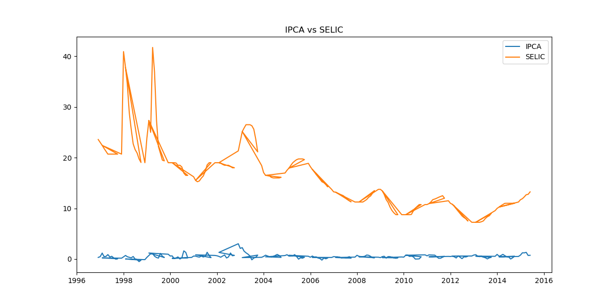

# prev_fundos_ml
Previsão do Montante de Fundos de Investimento com Machine Learning | Projeto de Estudo baseado no TCC de Ciência e Economia - UNIFAL/MG (Em desenvolvimento)

Sobre o projeto: Tem como objetivo analisar e modelar a relação entre indicadores macroeconômicos brasileiros, dando enfoque na previsão de comportamento de variáveis financeiras utilizando técnicas de Machine Learning.

Este estudo é baseado no meu Trabalho de Conclusão de Curso (TCC) em Ciência e Economia pela Universidade Federal de Alfenas - UNIFAL/MG, mas agora utilizando abordagens de Ciência de Dados.

Objetivo inicial é investigar padrões e relações entre váriáveis econômicas como: IPCA (inflação), Taxa SELIC, PIB, Poupança e avaliar a capacidade de modelos de Machine Learning em poder explicar ou talvez prever essas dinâmicas.

Etapas realizadas: Coleta de dados históricos (IPEADATA); Tratamento e limpeza dos dados; Padronização temporal (mensal); Análise exploratória (EDA); Visualização de dados; Cálculo de correlação entre variáveis; Construção de modelo inicial (Regressão Linear); Teste com defasagem temporal (lags).

Resultados iniciais: Houve baixa correlação entre IPCA e as variáveis analisadas; Modelo com baixo poder predição, pequena melhora ao incluir defasagens da SELIC.
Inicialmente tudo indica que o comportamento da inflação depende de múltiplos fatores além dos analisados.

Status do projeto: Em desenvolvimento, este projeto faz parte do meu processo de aprendizado em Ciência de Dados.

Tecnologias utilizadas: Python, Pandas, Matplottlib, Scikit-learn.

Sobre mim:
Estudante de Ciência de Dados (UNIVESP), atualmente no 4º período, com interesse em Inteligência Artificial, análise de dados e economia.

Gráfico comparando IPCA e taxa SELIC ao longo do tempo:

